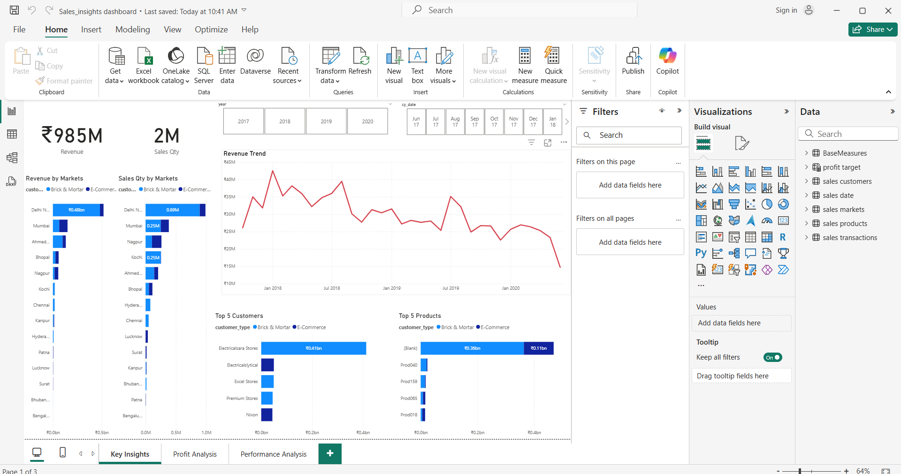
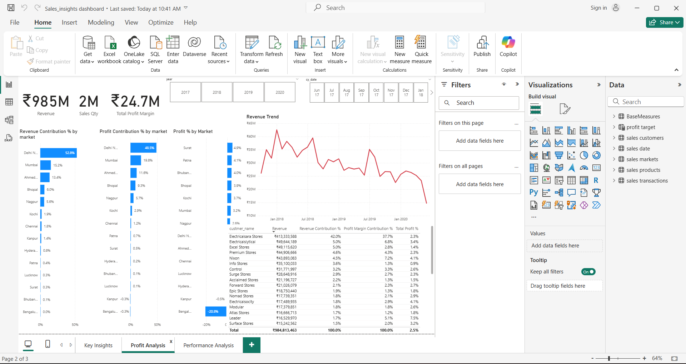
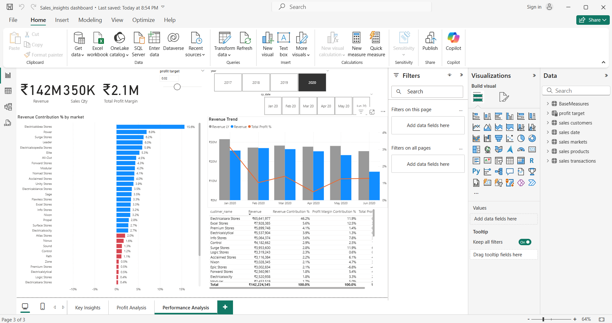

# 📊 Sales Insights Dashboard in Power BI

This project visualizes sales performance across various retail markets using an interactive dashboard built in Power BI. The dataset was imported from a MySQL database and includes transactional, customer, product, and market-level data.

---

## 🧰 Tools & Technologies Used

- Power BI (Data modeling, DAX, Visualizations)
- MySQL (Data source)
- Data Cleaning & Transformation in Power Query

---

## 📌 Key Features

- **Total Revenue, Sales Quantity, and Profit Margin** KPIs at the top
- **Revenue Contribution % by Market** (bar chart) — showing which markets drive the most revenue
- **Revenue Trend over Time** (clustered column + line chart) — showing revenue and profit % from Jan–Jun 2020
- **Profit Target Slicer** — dynamic control to filter based on profit margin thresholds
- **Year Filter & Date Hierarchy** — explore trends by year and month
- **Interactive Table View** — customer-wise breakdown of revenue, profit %, and contribution

---

## 🗃️ Data Source

- **MySQL Database**  
  Tables used: `sales_transactions`, `sales_customers`, `sales_products`, `sales_markets`, `sales_date`, `BaseMeasures`

---

## 📎 Insights Discovered

- **Electriciastica Stores** contributes ~15% of total revenue, leading all markets
- Profit % trends downward from Jan to Jun 2020 despite steady revenue
- Several store types have negative or very low profit margins, requiring performance review

## Power BI Dashboards

### Key Insights  

### Profit Analysis  

### Performance Analysis  

